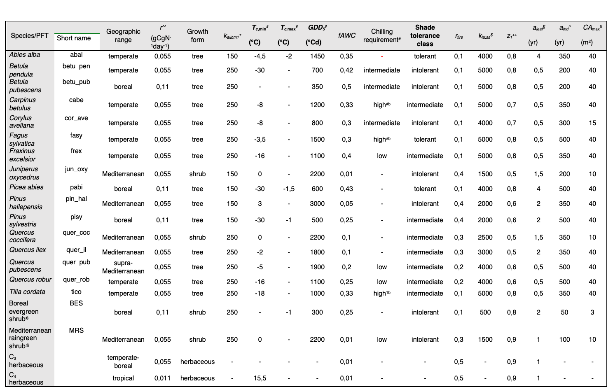

```{r setup, include=FALSE}
knitr::opts_chunk$set(echo = TRUE, fig.pos = "H", out.extra = "")

#knitr::opts_chunk$set(fig.pos = "!H", out.extra = "")
```

# Supplementary Material 1: Model reports

## 4C

### Authors

Mahnken M., Gutsch M., Reyer C.P.O., Lasch-Born P.

### Model

The most complete reference resource for the 4C (v2.2) model and
regeneration module is:

Lasch-Bonn et al. 2020. Description and evaluation of the process-based
forest model 4C v2.2 at four European forest sites. DOI:
[https://doi.org/10.5194/gmd-13-5311-2020)](https://doi.org/10.5194/gmd-13-5311-2020))

### Climate

We used the provided daily ERA5-CHELSA climate data set and complemented
the CHELSA time series data regarding relative humidity with the model
after Eccel et al. (2015) based on minimum and mean daily temperature to
accomodate data needs of 4C. The missing data for January 2nd and 3rd
2013 were filled with data from January 1st and 4th 2013 respectively.
For construction of longer climate time series we looped through the
provided time series from 1981 to 2018 up to the maximum simulation
length of 2500 years. We amended situations where leap year
inconsistencies arised by removing February 29 or duplicating data from
February 28. Otherwise, the unaltered daily data were used to run 4C on
a daily basis. We applied a constant atmopsheric CO2 concentration of
380 ppm.

### Soil

We used parametrized soils readily available for 4C from the EU soil
data base. The link from parametrized soil to soil quality was done by
extracting the plant available water storage capacity as the model
bucket size of the rooted soil horizons. We excluded bucket size values
of lower than 10 cm and larger than 35 cm. The bucket size was
reprojected to the range from 0 to 1. In addition we tested the
sensitivity of dominant tree height at age 100 years for monospecific
stands of all five species descibed above to the available soils using
model simulations with 4C. The dominant tree height at age 100 years was
then also reprojected to the range from 0 to 1 in order to derive a
model specific soil quality indicator for all paramterized soils. Then
we multiplied this relative model specific soil quality with the
relative soil quality derived from the bucket size to the range from 1
to 5. The match between paramterized soil and plot was then done by
finding the pair of soil quality with the minimum difference between
simuation protocol prescribed soil quality and and the soil quality of
the paramterized soils as described above.

### Topography

Topographical information was not considered in the simulations.

### Tree species

We initialized stands with five out of the eleven proposed
species/genera: Fagus sylvatica (fasy), Picea abies (piab), Betula spp.
(betu; 4C parameters for Betula pendula), Quercus spp. (quer; 4C
parameters for Quercus robur) and Pinus sylvestris (pisy) since only
these are fully parameterized for an application as proposed in the
simulation protocol. Each plot was initialized with all five tree
species with similar distributions of height classes and number of
individuals: 2000 individuals/ha with height around 0.25 m, 1000
individuals/ha with height around 0.75 m and 500 individuals/ha with
height around 1.75 m. In total 17500 individuals/ha. Carpinus betulus,
Tilia cordata, Acer pseudoplatanus, Fraxinus excelsior, Alnus glutinosa
and Abies alba are not fully parameterized in 4C.

### Simulations

#### Dispersal and seed input

There is no explicitly modelled seed dispersal in a stand and between
stands. We applied a constant sapling establishment rate every five
years of 2000 individuals/ha for all five species; 10000 individuals/ha
in total every five years. The constant sapling establishment provides
constant regeneration potential if favorable conditions for sapling
growth (especially light and water regime) are present. This approach
enables regeneration of other species than only the one present in the
stand to establish if competition allows. The resulting recruitment
patterns are an outcome of the dynamical processes from the sapling
stage onward. Seed production and germination were not explicitly
simulated.

#### Simulation length and equilibrium criteria

To reach equilibrium and obtain dynamics in the equilibrium period, we
simulated a maximum of 2500 years. 4C is usually applied for much
shorter simulation periods and different technical as well as
model-theory related issues arise when simulating longer than 100-150
years. Therefore 2500 years can be seen as the upper limit of continuous
simulation in the defined simulation setup. The first 500 years were not
sampled for recruitment as we assume the model needs this time to reach
equilibrium. In this long simulation period 4C partially projects
unrealistically large tree heights resulting in premature termination of
the simulation (36 plots) so that not all plots were simulated for the
full 2500 years. We started sampling the recruits after the first 500
simulation years from non-overlapping 10 year periods to obtain 200
samples. For shorter simulation periods we produced 200 samples from
overlapping 10 year periods. In addition, we excluded those plots in
which 4C simulated unrealistically high basal area values of over 150 m²
(19 plots). We used this large threshold to give the model maximum
flexibility to explore the solution space in these long simulation runs
although we acknowledge that this is an unrealistic overestimation that
is probably originating from misrepresented density dependent mortality
processes in long simulation runs and misrepresented single tree
dimensions due to wrong assumptions of tree geometry and biomass share
of such old-aged individuals. Furthermore those plots with less than
1000 simulation years (16 plots) before termination were excluded
because the sample space after the first 500 years was too small.
Additionally we included another subset criterion removing all samples
that have a ba \> 100 to exclude unrealistically high samples without
the need to exclude the full site. This resulted in discarding 0.8 % of
the sample

### Outputs

We provide 200 samples each for 165 of the 200 plots (see reason for
excluded plots in "Simulation length and equilibrium criteria"). These
stem from 10 year periods that overlap partially (for \< 2500 simulation
years) or do not overlap (for 2500 simulation years). The number of
recruits (r.trees) is the sum of individuals that cross the threshold
diameter (7/10 cm) in the 10 year sample period per hectare that have
not already died until the sample year (Fig. 3). The recruit's basal
area (r.ba) is the sum of the basal area per hectare of the trees that
cross the diameter threshold that have not already died until the sample
year. The total stand basal area (ba) is the basal area per hectare of
all trees in the stand \> 0 cm diameter at breast height (no lower
boundary) at the sample time per species. We provide the data for both
diameter thresholds, 7 and 10 cm. In over 90 % of the decades no
recruitment takes place.

[4C
(v2.2)](%5Bhttps://doi.org/10.5194/gmd-13-5311-2020)](<https://doi.org/10.5194/gmd-13-5311-2020>))
is usually not used for simulations of forest equillibrium dynamics,
potential natural vegetation assessment and long simulation periods but
rather shorter-term simulations (up to 100-150 years). In addition, only
five species out of the pool of eleven potentially relevant species here
are parameterized in 4C so that projections of the potential natural
vegetation done wih 4C need to be considered in the light of model
uncertainty. For example, the spatial homogeneity in the model leads to
cyclic recruitment patterns (see Fig. 4). When the adult stands dies of,
young individuals are recruited into the larger diameter classes because
more light reaches lower canopy layer since larger (adult) trees do not
anymore prevent the light reaching lower canopy layers. This results in
increased growth of the regeneration layer during those times. In most
stands Fagus sylvatica dominates the stand after some time but
occasionally individuals of other species, like Picea abies or Quercus
spp. cross the recruitment diameter threshold.

## ForCEEPS & ForCEEPS(f)

### Author

Xavier Morin & François de Coligny

### Model

The most complete reference resource for the ForCEEPS & ForCEEPS(f)
model and regeneration module are:

-   Morin X., de Coligny F., Bugmann H., Limousin J.-M., Ourcival J.-M.,
    Martin-StPaul N., Simioni G., Cailleret M., Prevosto B., Toïgo M.,
    Vennetier M., Cateau E., Guillemot J. 2021. Beyond forest
    succession: a gap model to study ecosystem functioning and tree
    community composition under climate change. Functional Ecology. 35,
    955-975.

-   Jourdan M., Dreyfus, P., Riond C., Cordonnier T., Cornet B., de
    Coligny F., Morin X. 2021. Managing mixed stands can mitigate severe
    climate change impacts on French alpine forests. Regional
    Environmental Change. 21, 78.

-   Morin X., Damestoy T., Toïgo M., Jactel H., Castagneyrol B.
    Meredieu C. 2020. Using forest gap models and experimental data to
    explore long-term effects of tree diversity on the productivity of
    mixed planted forests. Annals of Forest Science. 77
    <https://doi.org/10.1007/s13595-020-00954-0>.

### Climate

ForCEEPS requires monthly data. A 4000-yr long time-series was obtained
for each site by randomizing available years from the CHELSA database,
with mean monthly temperature and monthly sum of precipitations (see
1.2.2).

### Soil

Soil quality is represented by a continuous value between 1 and 5, as
provided (see 1.2.3) Soil Field Capacity (SFC) was assessed as follows:
SFC = 8+(X-1)\*(25-8)/(5-1), in which X is the 'soil_qual' value in the
provided 'soil_quality_200.csv' file.

### Topography

Not considered.

### Simulations

In each site, the simulation consists of 4000 yr-long simulation of 1ha
of forest (ie. 10 patches of 1000 m²), starting from bare-ground. There
was no dispersal between patches. Two kinds of simulations have been
carried out in each of the 200 sites. In a first set of simulations,
regeneration dynamics was simulated with a seed rain from a potential
species list, thus independent from the actual forest composition, as
classically done in gap models. Under this design, a number of seedling
is randomly chosen for each patch, and a species identity is randomly
sorted from a potential species list (defined at the start of
simulation) assigned to each seedling. Then each seedling tries to
colonize the site depending on whether the suitability between species
requirements and site conditions (climate, light, soil quality, browsing
index). In a second set of simulations, regeneration dynamics was
simulated with a seed rain whose composition depended on the actual
forest composition. Under this design, a number of seedling is randomly
chosen for each patch, but the species identity is assigned according to
species relative abundance (calculated across all 10 patches according
to species biomass). For instance, if at year i the adult trees of
species j represent 60% of the total biomass across the 10 patches, then
60% of the seedlings that try to colonize the patches at year i will
belong to species j. Then, similarly to the first design, each seedling
tries to colonize the site depending on whether the suitability between
species requirements and site conditions. In the two sets of
simulations, simulations have been run for both thresholds for
regeneration (7 and 10 cm).

### Outputs

Outputs consisted in species specific regeneration rates per decade and
per ha, by considering the last 2000 years of simulations to ensure that
pseudo-equilibrium state is reached. Results were aggregated for every
10 years for the last 2000 years at the 1ha-level. Variables: - Site:
numbers corresponding to the climate data file - Sample: one per decade,
for a total of 2000 years = identified from 1 to 200 - Species: name
specified as requested (eg. 'fasy') - r.trees: number of trees
outcrossing the threshold (7 or 10 cm) during the decade, for the 10
patches simulated (= 1ha), per species - r.ba: summed basal area of the
r.trees, per species - ba: summed basal area of all trees per species at
the end of the decade - dbh: threshold used

## FORMIND

### Authors

Samuel M. Fischer, Friedrich Bohn, Rico Fischer

### Model

```{=html}
<!--
@article{fischer_lessons_2016,
    title = {Lessons learned from applying a forest gap model to understand ecosystem and carbon dynamics of complex tropical forests},
    volume = {326},
    issn = {03043800},
    url = {https://linkinghub.elsevier.com/retrieve/pii/S0304380015005505},
    doi = {10.1016/j.ecolmodel.2015.11.018},
    language = {en},
    urldate = {2022-09-15},
    journal = {Ecological Modelling},
    author = {Fischer, Rico and Bohn, Friedrich and Dantas de Paula, Mateus and Dislich, Claudia and Groeneveld, J{\"u}rgen and Guti{\'e}rrez, Alvaro G. and Kazmierczak, Martin and Knapp, Nikolai and Lehmann, Sebastian and Paulick, Sebastian and P{\"u}tz, Sandro and R{\"o}dig, Edna and Taubert, Franziska and K{\"o}hler, Peter and Huth, Andreas},
    month = apr,
    year = {2016},
    pages = {124--133},
    file = {Volltext:C\:\\Users\\fischsam\\Zotero\\storage\\EISNTZF6\\Fischer et al. - 2016 - Lessons learned from applying a forest gap model t.pdf:application/pdf},
}
-->
```
A full description of the model can be found in @fischer_lessons_2016.
The basis for the parameterization we applied is described in @bohn2014.

### Climate

To incorporate climate, we used the data set
\`daily_era5_chelsa_200.csv', which contains climate data on a daily
resolution. We considered the covariates precipitation, temperature, and
irradiance, the latter of which we converted to units used in Formind.
Adding on to these data, we used a constant and site-independent
potential evapotranspiration (PET) value of
$4\frac{\text{mm}}{\text{d}}$ and assumed that the mean day length was
$12\text{h}$ at all sites.

Since we simulated longer time periods than the $38$ years for which we
had climate data, we used the provided data in a randomized fashion. For
each simulation year, we applied the climate data of a randomly selected
year. We neglected the existence of leap years, which led to a minor
time shift in climate data of later years.

### Soil

We modelled soil conditions by using the provided soil quality values as
proxy for soil depth. To that end, we scaled the provided values to the
typical range of soil depth values used in Formind for temperate
forests. Specifically, we multiplied the soil quality values by factor
$0.5$ to obtain the modelled soil depth in meters.

### Topography

We did not use any topography data.

### Tree species

We considered each of the $11$ species in the protocol explicitly. We
chose the model parameters for the individual species based on the work
by @bohn2014. For species that were not covered by @bohn2014, we used
parameter values of similar species with known parameters. The species
composition was not predefined and evolved solely from the seed input
and the model dynamics.

### Simulations

#### Simulation area

We simulated a forest area of $1\text{ha}$, which was divided into $25$
patches of size $20\text{m}\times20\text{m}$. No interactions between
trees from different patches were considered in the model. That is, the
$25$ patches were independent replicates of one another.

#### Seed generation and dispersal

We modelled seed generation as global external seed rain. Specifically,
we assumed that for each species, there is a constant seed inflow of
$250\frac{\text{seeds}}{\text{ha}\cdot \text{yr}}$, which is distributed
evenly among the $25$ individual patches. We supposed that all seeds
promptly establish to seedlings with initial stem diameters at breast
height (DBH) of 5\text{cm}.

#### Simulation length and sampling approach

We started the simulation at each site with a burn-in phase of $1000$
years and collected samples of the output variables in subsequent years.
The length of the burn-in phase was chosen based on earlier experiences
with the model. To confirm that the model reached its limiting
behaviour, we plotted the evolution of the output variables (e.g. the
basal area) at selected sites over time and verified that no trends were
visible after the burn-in phase.

We computed the output variables in equidistant time intervals of $60$
years. Before taking a sample, we saved parts of the model's state.
Then, we simulated the forest for $10$ years and computed the output
variables, comparing the model's current state with the state saved
earlier (see below). After taking the sample, we simulated the forest
for another $50$ years to reduce correlations between samples. Then, we
repeated the procedure until the desired number of $200$ samples was
collected.

### Outputs

To determine the number and basal area of recruits, we compared the set
of large trees before and after the regeneration time period of $10$
years. Prior to simulating the forest for the regeneration time period,
we saved the internal IDs of all trees with DBHs above the thresholds of
$0.07\text{m}$ or $0.1\text{m}$, respectively. We stored these IDs in
set data structures $S_{0.07}^{\text{prior}}$ and
$S_{0.1}^{\text{prior}}$, corresponding to one threshold value each.
After the regeneration time, we repeated the procedure, obtaining tree
ID sets $S_{0.07}^{\text{posterior}}$ and $S_{0.1}^{\text{posterior}}$.
We then computed the set differences
$S_{0.07}^{\text{recruits}}=S_{0.07}^{\text{posterior}}\backslash S_{0.07}^{\text{prior}}$
and
$S_{0.1}^{\text{recruits}}=S_{0.1}^{\text{posterior}}\backslash S_{0.1}^{\text{prior}}$
and determined both the number and cumulative basal area of the trees in
$S_{0.07}^{\text{recruits}}$ and $S_{0.1}^{\text{recruits}}$ by
considered species, respectively.

Finally, we computed the total basal area for each considered species by
adding up the basal areas of all corresponding individuals. Note that
the initial DBH of seedlings in our model was $0.05\text{m}$.
Consequently, smaller trees were not included in the basal area
computation.

## ForClim 1 & ForClim 11

### Authors

Yannek Käber, Harald Bugmann

### Model

The most complete reference resource for the ForClim 1 & ForClim 11
model and regeneration module is:

-   Bugmann, H. (1994). On the ecology of mountainous forests in a
    changing climate: A simulation study. Huber, N., Bugmann, H., &
    Lafond, V. (2020). Capturing ecological processes in dynamic forest
    models: Why there is no silver bullet to cope with complexity.
    Ecosphere, 11(5). <https://doi.org/10.1002/ecs2.3109>

### Climate

Temperature and precipitation were aggregated to monthly means and sums,
respectively, including their standard deviation. These values served as
input for the weather generator within the model. The weather generator
simulates wheather conditions in an annual time step based on the
monthly average temperatures and precipitations sums.

### Soil

Soil data were translated to bucket sizes values based on the assumption
that the lowest soil quality value of 1 refers to a bucket size of 10 cm
and the highest soil quality of 5 refers to a bucket size of 35 cm.
Specifically we used the following formula to calculate the bucket size
bucket_size = 10 + (soil_quality-1) /4  \* 25.

### Topography

Topographic information was included by specifying the kSlAsp parameter.
This parameter defines a value between -2 and 2 which affects the
calculated Potential Evapotranspiration within the model. For details on
the calculation of this value see Käber et. al. 2021.

### Tree species

All species required were simulated: Fagus sylvatica, Picea abies, Abies
alba, Carpinus betulus, Tilia cordata, Acer pseudoplatanus, Betula spp.,
Fraxinus excelsior, Quercus spp., Alnus glutinosa, Pinus sylvestris

In addition the following species were simulated: Acer campestre, Acer
platanoides, Alnus incana, Alnus viridis, Castanea sativa, Corylus
avellana, Larix decidua, Pinus montana, Populus nigra, Populus tremula,
Salix alba, Sorbus aria, Sorbus aucuparia, Taxus baccata, Tilia
platyphyllos, Ulmus glabra, Pinus cembra

### Simulations

All simulations were run according to the protocol. For each site we
simulated on 16 ha (i.e., 100 patches of 0.08 ha). We defined a spin up
phase of 1000 years. After the spin up we simulated 200 years of forest
dynamics.

### Outputs

We sampled in 10 year intervals between the simulation years 1010 to
1200, which resulted in 16 times 20 intervals each with one ha.

## SIBYLA

### Authors

Ján Merganič1, Katarína Merganičová2,3, Marek Fabrika1, Peter Valent1

1Technical University in Zvolen, Faculty of Forestry, T. G. Masaryka 24,
960 53 Zvolen, Slovak Republic

2Department of Biodiversity of Ecosystems and Landscape, Slovak Academy
of Sciences, Štefánikova 3, P.O.Box 25, 81499 Bratislava, Slovakia

3Czech University of Life Sciences Prague, Faculty of Forestry and Wood
Sciences, Kamýcká 129, 16500 Praha 6 -- Suchdol, Czech Republic

### Model

SIBYLA is the simulator of forest biodynamics. It belongs to the
category of semi-empirical tree growth simulators. It consists of the
set of mathematical models and algorithms that are transformed into an
integrated software package SIBYLA Suite. The model has been developed
at the Department of Forest Management and Geodesy, Technical University
in Zvolen, Slovakia. The basis of the model was the modelling principle
and algorithms implemented in SILVA 2.2 (Pretzsch 1992, Kahn 1994). The
model is sensitive to climatic factors (length of growing season, mean
temperature during growing season, annual temperature amplitude, and
total precipitation during growing season). The climatic factors modify
height and diameter growth potential, and consequently tree increment.
The climatic factors also influence tree regeneration model.

The most complete reference resource for the SIBYLA model and
regeneration module is:

-   Fabrika (2005) and in the link:
    <http://etools.tuzvo.sk/sibyla/english/model.htm>.

### Climate

We used CHELSEA monthly and daily time series from 1981 to 2018 to
derive climate variables necessary for simulations with SIBYLA as
follows: Monthly average temperature (tas) values were used to derive
the SIBYLA site-specific characteristic called the „annual temperature
amplitude" (labelled as TAMPL or s5 in the model) that was calculated as
a difference between the maximum and minimum monthly average
temperatures. Monthly average temperature (tas) values for months April
to September were used to derive the SIBYLA site-specific characteristic
called the „average temperature during the growing season" (labelled as
TEMP or s6 in the model). Monthly precipitation sums (pr) for months
April to September were summed up to derive the SIBYLA site-specific
characteristic called the „precipitation total during the growing
season" (labelled as PRECIP or s8 in the model). Daily average
temperature (tas) values were used to derive the SIBYLA site-specific
characteristic called the „length of the growing season" (labelled as
DAYS or s4 in the model).

### Soil

The information on site-specific soil quality (file name:
soil_quality_200.csv) was used to define two SIBYLA site-specific
characteristic called the „soil moisture" (labelled as MOIST or s7 in
the model) and the „soil nutrient supply" (labelled as NUTR or s3).
Since these two characteristics can obtain values in the range from 0 to
1, the provided values on soil quality were converted to this range by
dividing each value with 5 (the maximum). We used the long-term average
of CO2 concentrations in air that represented the period 1981 -- 2018.
The long-term average of CO2 was calculated from the annual CO2 data
obtained from Mauna Loa observations (Keeling et al. 1976). Similarly,
we used the long-term NOx concentration representing the time period
1981-2018. This was obtained by averaging annual values of NOx
concentration in air calculated using the equation by Kahn (1994), where
the year is the driving variable.

### Topograhpy

The growth simulator SIBYLA uses the model of ecological classification
applied in the growth simulator SILVA 2.2, which was derived by Kahn
(1994). Site is specified using ecological site characteristics
describing climate, air, and soil, also called site variables: • s1
(N2O) ... NOx concentration in air (ppb) • s2 (CO2) ... CO2
concentration in air (ppm) • s3 (NUTR) ... soil nutrient supply
(relative value in the range from 0 to 1) • s4 (DAYS) ... number of days
in the vegetation period (days with daily mean temperature above 10°C) •
s5 (TAMPL) ... annual temperature amplitude (the difference between
minimum and maximum monthly temperature in °C) • s6 (TEMP) ... daily
mean temperature in the vegetation period in °C (from April to
September) • s7 (MOIST) ...soil moisture (relative value in the range
from 0 to 1) • s8 (PRECIP) ... precipitation amount in the vegetation
period in mm (from April to September) • s9 (ARID)... aridity index
according to de Martone in mm.°C-1 They directly influence the
production capacity of a stand (tree height and diameter increment).

### Tree species

At the beginning of the simulations we determined balanced tree species
composition of all 12 tree species pre-defined in the „Regeneration
workshop protocol". It means that at the beginning each species was
represented by the same volume, mean tree diameter, mean tree height,
and age.

### Simulations

The simulations were performed following the "Regeneration workshop
protocol". Hence, we simulated the pre-defined 200 sites with the model
SIBYLA under current climate. The simulations were performed with the
help of two software tools for automatised handling of multiple sites to
speed up the process called DBCreator and Automat (Valent et al. 2018).

#### Simulation area and site

We set the simulation area to 1ha, i.e. each site was represented by an
area of 1 ha, to enable a sufficiently large area for species
interactions. Larger areas were not possible due to the restrictions in
the number of trees per plot (the maximum number of trees per plot is
6,000). Due to the restriction in the maximum number of trees per plot
we established a 40-year-old forest stand at each site with the balanced
tree species composition as defined above. We used site-specific
elevation and aspect obtained from the information on topography and
elevation (file name: topo_data_200.csv).

#### Simulation length

Each site was simulated for 3,000 years. Based on the analysis of the
temporal development of multiple stand variables including number of
trees, mean tree and stand characteristics, the simulation time until
the equilibrium was set to 500 years. Hence, the first 500 simulated
years were excluded from the results. The submitted output includes the
required information per decade during the 2,500 years.

#### Dispersal

Relevant aspects of the dispersal (if any) and seed input parameters in
your model The regeneration model operates if there are mature trees
able to produce seeds. Hence, the initial forest stand had to be
established to allow the reproduction and regeneration module. The seed
yield of individual trees is predicted in relation to species-specific
characteristics including tree age interval of seed production and
fertility (age of start, optimum and end), seed production per adult
tree, transmission distance, seed purity, seed quality, germination
capacity, absolute weight of seeds. Seed tree production is further
modified with the regulators and reduction factors, which describe other
conditions necessary for the germination, survival, and the
establishment of the next generation, e.g. stand canopy closure (Fabrika
2005, Merganič and Fabrika 2009, Fabrika et. al. 2009, 2011).

### Outputs

To derive the required information, we worked with the model output for
individual trees per decade. First, we calculated basal area of
individual trees from the simulated diameter at breast height using the
equation for the area of a circle. Total basal area (ba) was obtained by
summing tree basal areas per species and decade. The number or recruits
(r.trees) per species was derived by counting the trees that exceeded
the diameter threshold (7 or 10 cm) in the specific time. The basal area
of recruits (r.ba) per species was calculated by summing tree basal
areas of recruits per species. NA was assigned if no trees of a specific
species occurred in the period.

### References

Fabrika M., Merganič J., Merganičová K., 2009: Natural regeneration
density model developed for the purposes of the individual-tree growth
simulator. Acta Facultatis Forestalis Zvolen, 51(3), p. 125-137, ISSN:
0231-5785 Fabrika, M., (2005): Simulátor biodynamiky lesa SIBYLA,
koncepcia, konštrukcia a programové riešenie. Habilitačná práca.
Technická univerzita vo Zvolene, 238 p. Kahn, M., (1994): Modellierung
der Höhenentwicklung ausgewählter Baumarten in Abhängigkeit vom
Standort. Forstliche Forschungsber. München, Vol. 141, 221 p. Keeling C.
D., R. B. Bacastow, A. E. Bainbridge, C. A. Ekdahl Jr., P. R. Guenther,
L. S. Waterman, J. F. S. Chin 1976: Atmospheric carbon dioxide
variations at Mauna Loa Observatory, Hawaii. Tellus. XXVIII, 6: 538-551,
<https://doi.org/10.1111/j.2153-3490.1976.tb00701.x> Merganič J.,
Fabrika M., 2009: Determination of climatic-site strata based on
rectified climatic rasters for the purposes of natural regeneration
density model. Acta Facultatis Forestalis Zvolen, 51(3), p. 113-124,
ISSN: 0231-5785 Merganič, J., Fabrika, M., Merganičová, K., 2011:
Submodel of height-diameter function for climatic-site strata of the
model of natural regeneration in the growth simulator SIBYLA. Acta
Facultatis Forestalis Zvolen, 53(1), p.155-168, ISSN: 0231-5785
Pretzsch, H., (1992): Konzeption und Konstruktion von Wuchsmodellen für
Rein- und Mischbestände. Forstliche Forschungsberichte München, Nr.115,
358 p. Valent, P., Merganič J., Výbošťok J. 2018: Optimus -- Software
for Multi-criteria analysis. TU Zvolen.

## xComp

### Authors

Tobias Mette, LWF, 24.05.2022

### Model

*Please provide here the references to this model where it is possible
to understand the model structure specially for the regeneration module,
this could be a published paper, a website with the model description, a
manual or some other document that the reader can access.*

The forest growth model xcomp was developed to simulate gap dynamics of
monospecific stands with a strong emphasis on position-dependent
individual tree competition. The model consists of three units: (1) the
main growth phase which determines the growth and mortality of each
individual tree above 5 cm dbh, (2) the old-growth phase where
individual trees exceeding a certain dbh-limit decline in vitality and
eventually die, and (3) the regeneration phase where seedling growth and
mortality is modelled depending on light availability. The primary focus
of the model was to establish a set of robust algorithms that can be
flexibly calibrated for different species attributes. The model was used
to simulate single-species stand development cycles for Nothofagus
pumilio in Patagonia (Mette 2014), for European beech in NE-Bavaria
(Mette et al. 2016) and a Norway spruce stand with different mortality
algorithms (Bugmann et al. 2019). For the current article the model was
(4) connected to a climate sensitive species distribution model to
modify growth and mortality in dependence of the site conditions, and
(5) extended from single to multi-species simulations.

The most complete reference resource for the xComp model and
regeneration module is:

-   

### Climate

### Soil

### Topography

### Tree species

### Simulations

The simulation was carried out according to the protocol by Bugmann et
al. (2022). I.e. the simulation is initiated for mixed species stands of
1 ha size at 200 sites of with given climate and soil conditions. The
initial species mix consists of up to 10 species of equal shares with an
initial root mean square diameter dq of 8 cm. From the suggested species
spectrum Alnus glutinosa and Fraxinus excelsior were not included in the
species mix. Quercus spec was split into Q. petraea and Q. pubescens,
but united in the validation to meet the protocol. Xcomp simulates
forest growth in 5 year intervals. Data are validated after having
reached a climate dependent equilibrium -- which is typically the case
after 750 years (= 150 simulation periods). Starting with year 760, data
are read out for 200 10 year intervals (until year 2750, simulation
period 550).

#### Model details

(1) The main growth phase is determined by the processes growth and
    mortality. Mortality is determined by the Reineke exponent rke and
    the stand density sdi and calibrated over a range of 8 cm to 50 cm
    dq (= root mean square diameter) so that stem number N equals: N =
    sdi*(dq/25)\^rke. A tree's resource acquisition area res (m2) is
    approximated as res = 1e4/ (sdi*(dbh/25)\^rke). As the Reineke
    exponent is fixed to 1.6, species with higher/ lower sdi have a
    lower/ higher resource acquisition area for a given dbh. Potential
    dbh growth dd is calculated by multiplying a reference dbh growth
    with a site specific temperature dependent modifier. The individual
    dbh growth in the stand is further modified by the neighbourhood
    competition.

(2) The old growth phase sets in when a tree passes a certain old growth
    dbh (ogDbh) which depends on the site conditions. Having passed this
    threshold dbh a tree is assigned a mortality period that assumes a
    value not greater the a site independent maximum ogPer. The maximum
    old growth time span ranges from 100 years (birch) to 350 years
    (fir). During the old growth phase dbh growth declines and more
    light becomes available for regeneration.

(3) The regeneration phase allows seedling development on a 1x1 m grid
    over the entire stand. First, a light availability matrix (1x1 m) is
    calculated from a cumulative crown shadow which decreases with
    increasing distance to the tree center. Next, regeneration matrices
    (1x1 m) are created for each of the stand's species. In the initial
    period, the regeneration matrix of each species is empty, but at the
    end of each period, a light dependent dbh growth and mortality is
    calculated for each 1m raster cell. The dbh growth is scaled so that
    under full light 5 cm dbh is reached in a defined regeneration
    period (regnPer) that depends on the site conditions. The default
    value is set to 15 years and equal for all species. Dbh growth is
    modified by the light availability and the species' regeneration
    light demand. This is a decisive difference between the species and
    favours shadow-tolerant trees like fir and beech in the absence of
    large gaps. However, each raster cell is afflicted with a species
    bonus or malus that provides local variation to the global
    regeneration parameters. Mortality in the regeneration raster occurs
    as a random process, the likelyhood of which depends on the climate.

(4) The climate sensitivity was calculated by methods of species
    distribution modelling. Effectively species abundance in European
    NFI-plots (Mauri et al. 2017) was related to climate of the plots
    (Karger et al. 2017) using generalized additive models as in Thurm
    et al. (2018). Input variables were summer temperature mean
    (Jun-Aug), winter temperature mean (Dec-Feb) and summer
    precipitation sum (Jun-Aug). Abundance was transformed into
    prevalence () so that the values for each species can assume a range
    from 0 to 1. The prevalence values modify dbh growth dd, old growth
    dbh ogDbh, the regeneration period regnPer, and the regeneration
    mortality regnMort.

(5) The extension from single to multiple species simulation introduced
    no technical changes to the single-species growth and mortality
    behaviour. Competition as the main interaction between trees depends
    on the crown size and density of the neighbouring trees and can turn
    out an dis/advantage for one or the other species. But species
    calibration parameters were not changed due to mixture-specific
    interaction.

### Outputs

The processes that determine the species composition and turnover in
xcomp can be explained best by an example. In Fig. 1, I displayed the
basal area shares resulting from the simulation of site 434 over a time
span of 2750 years. Tab. 1 shows the species calibration parameters for
the site. It is a very favourable site with modelled species prevalences
of 0.93 (beech), 0.86/7 (spruce, maple), 0.81/2 (fir, ped. oak), 0.76/4
(hornbeam, lim, birch), and 0.70 (pine). Starting with more or less
equal basal area shares and 8 cm dq (root mean square dbh), all species
increase their basal area in the first 50 years. Thereafter increased
competition and starting old growth leads to a decline -- first, in all
of the species but spruce, fir and beech, but after 100 years also in
spruce. Only in fir and beech regeneration balances the loss of older
trees. The result is an equilibrium of a dense fir and beech forest with
high basal area where more light demanding species regenerate too little
to contribute significantly.

#### Discussion

xcomp is a very deterministic model where except for mortality and a
random species regeneration malus/ bonus on the regeneration raster.
This leads to equilibria of one or two species. What species depends
strongly on the light demand of the regeneration which favours fir and
beech in the absence of large gaps creating disturbances. The second
most important parameter is the site suitability which is estimated by
the modelled species prevalence and affects growth and thereby
competitivity. As it is the first time that xcomp is used in a multiple
species application there is room for improvements. The automation of a
robust calibration of the main growth phase is a precondition to
investigate how for instance larger disturbances, a weighted
regeneration potential oriented at the main stand, higher or selective
mortality of the regeneration affect the species composition and
turnover.

### references

1.  Bugmann, H., Seidl, R., Hartig, F., Bohn, F., Brůna, J., Cailleret,
    M., ... & Reyer, C. P. (2019). Tree mortality submodels drive
    simulated long‐term forest dynamics: Assessing 15 models from the
    stand to global scale. Ecosphere, 10(2), e02616.
2.  Karger, D. N., Conrad, O., Böhner, J., Kawohl, T., Kreft, H.,
    Soria-Auza, R. W., ... & Kessler, M. (2017). Climatologies at high
    resolution for the earth's land surface areas. Scientific data,
    4(1), 1-20.
3.  Mauri, A., Strona, G., & San-Miguel-Ayanz, J. (2017). EU-Forest, a
    high-resolution tree occurrence dataset for Europe. Scientific data,
    4(1), 1-8.
4.  Mette, T. (2014) Using Reineke to self-calibrate mortality in
    individual tree based forest growth modelling. Beiträge zur
    Forstwissenschaftlichen Tagung, Dresden, 17.-20.09.2014
5.  Mette, T., Falk, W., Blaschke, M., Förster, B., Walentowski, H.
    (2016). Modelling natural forest dynamics in individual tree based
    forest growth simulators. Beiträge zur Forstwissenschaftlichen
    Tagung, Freiburg, 26.-29.09.2016
6.  Thurm, E. A., Hernandez, L., Baltensweiler, A., Ayan, S.,
    Rasztovits, E., Bielak, K., ... & Falk, W. (2018). Alternative tree
    species under climate warming in managed European forests. Forest
    Ecology and Management, 430, 485-497.

## PICUS

### Authors

Christian Hochauer, Manfred J. Lexer

### Model

The core elements of PICUS are described in Lexer and Hönninger (2001)
and Seidl et al. (2005). Specific details regarding the regeneration
module can be found in Woltjer et al. (2008).

-   Lexer MJ, Hönninger K (2001) A modified 3D-patch model for spatially
    explicit simulation of vegetation composition in heterogeneous
    landscapes. For Ecol Manag 144:43--65.
    doi:10.1016/S0378-1127(00)00386-8

-   Seidl R, Lexer MJ, Jäger D, Hönninger K (2005) Evaluating the
    accuracy and generality of a hybrid patch model. Tree Physiol
    25:939--951. doi:10.1093/treephys/25.7.939

-   Woltjer M, Rammer W, Brauner M, Seidl R, Mohren GMJ, Lexer MJ (2008)
    Coupling a 3D patch model and a rockfall module to assess rockfall
    protection in mountain forests. J Environ Manag 87:373--388.
    doi:10.1016/j.jenvman.2007.01.031

### Climate

We used the provided monthly climate data (monthly_era5_chelsa_200.csv).
The provided solar radiation rsds was converted to MJ per m².
Additionally, vpd was calculated.

### Soil

Based on the provided continuous value for soil quality between 1 and 5
minimum (soil quality = 1) and maximum (soil quality = 5) values for
soil water holding capacity (80mm, 200mm), plant available Nitrogen (40
kg ha^-1^ yr^-1^, 100 kg ha^-1^ yr^-1^) and soil pH (4.2, 5.6) were
defined. Linear interpolation was used to scale between the minimum and
maximum values.

### Topography

Not considered.

### Tree species

The species composition was defined by the given species from the
protocol: Fagus sylvatica, Picea abies, Abies alba, Carpinus betulus,
Tilia cordata, Acer pseudoplatanus, Betula spp., Fraxinus excelsior,
Quercus spp., Alnus glutinosa and Pinus sylvestris. For Betula spp.
Betula pendula was simulated, for Quercus spp. the species Quercus
petraea and Quercus robur where used. The establishment from bare ground
was achieved via external seed input (see also in section seed
dispersal), so depending on the environment and random components all
the given species had a chance to grow into the respective simulation.
In addition, on site production of seed is considered depending on age
and size of potential parent trees.

### Simulations

#### Simulation Area

In PICUS the area is defined via the number of 10 m by 10 m patches. For
this simulation we used an area of 12 by 12 patches resulting in an area
of 1.44 ha. This size of the simulated forest provides relatively stable
species composition & structure and reasonable simulation time.

#### Seed dispersal

For the experiment seed input to the simulated forest happens via 2
pathways: (1) external seed input to every patch in any simulated year
(fixed number of seed per patch per species). (2) locally produced seed
by parent trees growing in the simulated forest. Seed production depends
on species, and tree size and a random component accounting for mast
years. Seed dispersal depends on whether a species is anemochorous or
zoochorous. If anemochorous tree height and seed characteristics
determine the maximum dispersal range and the shape of the dispersal
function. Based on germination rate, the environmental factors
(temperature, soil moisture, Nitrogen, light) and the amount of seeds in
combination with a random component seedling establishment is calculated
per patch in any given year. Seedling cohorts grow through 4 height
classes and are then eventually recruited into the tree population.

#### Simulation length

We decided to use the temporal sampling. We first run the model into a
quasi equilibrium and continue afterwards with another 2000 years. The
simulation time until equilibrium was chosen with 600 years from
experience in other projects and a few simulations with test sites where
600 years was a sufficiently long simulation time to reach an
equilibrium state.

### Output

Output consisted of species-specific regeneration rates per decade and
per ha. Oak species were aggregated. A sample was taken for every 10
years for a total period of 2000 years once the model had reached
equilibrium (see 1.7.7.3). Ingrowth was determined by counting the trees
passing the 7cm and 10cm DBH thresholds every 10 years. Basal area of
the ingrowth was determined at the end of each decade.

## iLand

### Authors

Werner Rammer, Kristin Braziunas

### Model

The most complete reference resource for the iLand regeneration module
is:

-   Seidl, R., Spies, T. a. T. A. T. a., Rammer, W., Steel, E. A. A.,
    Pabst, R. J. R. J. R. J., & Olsen, K. (2012). Multi-scale Drivers of
    Spatial Variation in Old-Growth Forest Carbon Density Disentangled
    with Lidar and an Individual-Based Landscape Model. Ecosystems,
    15(8), 1321-1335. <https://doi.org/10.1007/s10021-012-9587-2>

### Climate

Climate inputs for iLand are at daily temporal resolution. We used daily
climate from the CHELSA dataset for maximum and minimum temperature,
precipitation, and surface shortwave radiation. We calculated daily
vapor pressure deficit (VPD) from these inputs assuming daily minimum
temperature is dewpoint temperature, a reasonable assumption except
under very arid conditions (Campbell and Norman 2000). We calculated
vapor pressure from temperature using the Tetens formula with different
coefficients for temperatures above or below 0° C (Murray 1967). We then
followed methods outlined by the Food and Agriculture Organization of
the United Nations (Allen et al. 1998) to calculate vapor pressure
deficit as the difference between average daily saturation vapor
pressure (derived from minimum and maximum temperature) and ambient
vapor pressure derived from dewpoint temperature. Some daily VPD values
were negative because there were days in the CHELSA dataset where
minimum temperature exceeded maximum temperature; negative VPD values
were set to 0.

As recommended by workshop organizers, we filled in daily values for two
missing days in 2013 (Jan 2 and Jan 3) with daily values for Jan 1 and
4, respectively.

Atmospheric CO2 concentration was set to 380 ppm and latitude was set to
50° N for all sites. Annual climate year was drawn randomly with
replacement from the full dataset (1981-2018) for each site for the
duration of the simulation.

### Soil

### Topography

### Tree species

Tree composition is defined at the species level. All individually
requested species (Fagus sylvatica, Picea abies, Abies alba, Carpinus
betulus, Tilia cordata, Acer pseudoplatanus, Fraxinus excelsior, Alnus
glutinosa, Pinus sylvestris) were included. For the two taxa where
species was not defined, we identified a representative species (Betula
pendula for Betula spp. and Quercus robur for Quercus spp.). No other
species were included in model simulations.

### Simulations

#### Simulation area

The simulation extent for each site was 1000 m x 1000 m (total area =
100 ha). Environmental conditions were homogeneous for each site, and we
did not use topographic information. Inputs for soil depth, texture, and
fertility (plant available nitrogen) were extracted from a previously
compiled Europe-wide dataset. We averaged values in a 1 km buffer around
blurred site coordinates provided by workshop organizers. Relationships
between ranked site quality provided by workshop organizers and soils
data from our Europe-wide dataset were weak (Pearson's \|r\| ranged from
0.04 to 0.34), but followed expected trends with lower sand content,
higher water holding capacity, and higher fertility associated with
higher site quality. Albeit the weak correlation, we chose to use our
available data set because we could avoid additional assumptions as it
included all site variables needed for the model.

#### Dispersal

Dispersal parameters are species-specific and include maturity age,
fecundity (seedling potential per m2 crown area), masting (lower seed
production in non-mast years), and dispersal distance (probabilistic
dispersal kernel). A small fraction of seeds are dispersed over longer
distances (long distance dispersal algorithm). Dispersal is calculated
at 20 m spatial resolution. Seedling establishment is further modified
by other environmental constraints and is stochastically spatially
distributed at finer (2 m) resolution. The simulation extent is treated
as a spatially explicit landscape, so neighboring cells can serve as
seed sources for each other.

We initialized our simulation experiments from bare ground with uniform
probability of seed availability set to a low level (0.001) for all
species. Once trees reached maturity, they also contributed to seed
availability and dispersal.

#### Simulation length

Simulations were run for 2010 years, and equilibrium was reached at year
1500. We assessed temporal patterns of species composition and basal
area and defined equilibrium as when forest composition and structure
stabilized across all sites ("potential natural vegetation"). Some sites
had high interannual variation, especially in basal area, after
equilibrium; this variation did not represent directional change and
appeared instead to be related to sites with extreme growth conditions
and variation in randomly selected annual climate.

#### Simulation approaches

Only one simulation was run per site.

### Output

For each site, we generated decadal outputs for the full simulation
extent every 100 years after equilibrium was reached (i.e., 1500-1509,
1600-1609, ..., 2000-2009). This resulted in outputs for a total of 600
ha (100 ha simulation extent x 6 decades). From this list, we randomly
sampled 200 ha without replacement.

We derived recruit density and basal area annually by species. Trees \>
4 m in height are represented as individuals in iLand, so we were able
to identify individual trees that crossed the DBH threshold of either 7
or 10 cm each year. We summed the number of annual recruits and their
basal area in the year they crossed the recruitment threshold for each
10-year output period.

We averaged total density and basal area by species for each decade. We
further included 0 values (complete cases) for species that were missing
from a given sample and site.

### References

Allen, R. G., L. S. Pereira, D. Raes, and M. Smith. 1998. Crop
evapotranspiration - Guidelines for computing crop water requirements.
FAO - Food and Agriculture Organization of the United Nations,
Irrigation and drainage paper 56. Campbell, G. S., and J. M. Norman.
2000. An Introduction to Environmental Biophysics. Springer Science &
Business Media. Murray, F. W. 1967. On the computation of saturation
vapor pressure. Journal of Applied Meteorology 6:203--204.

## LandClim

### Authors

### Model

*Please provide here the references to this model where it is possible
to understand the model structure specially for the regeneration module,
this could be a published paper, a website with the model description, a
manual or some other document that the reader can access.*

The most complete reference resource for the LandClim model and
regeneration module is:

-   

### Climate

### Soil

### Topography

### Tree species

### Simulations

### Outputs

## Landis II

### Authors

Josef Brůna, Paola Mairota, Marco Mina, Giorgio Vacchiano

### Model

Landscape scale forest simulation model LANDIS-II (Scheller et al. 2007)
with PnET-Succession extension (version 4.1). PnET-Succession is based
on the Biomass Succession extension of Scheller and Mladenoff (2004),
embedding elements of the PnET-II ecophysiology model of Aber et al.
(1995) to mechanistically simulate growth as a competition for available
light and water (De Bruijn et al. 2014). PnET-Succession simulates the
competition among cohorts for water and light at a monthly time-step as
a function of photosynthetic processes and maintenance respiration that
are explicitly linked to environmental drivers such as temperature,
precipitation, photosynthetic active radiation (PAR), and CO~2~
concentration. Regeneration depends on distance from a seed source, soil
water, and subcanopy light, while competition is modeled by partitioning
incoming light through multiple canopy layers. Growth of specific cohort
biomass components is allocated in the following order: non structural
carbon, first, then foliage then root and stem. Biomass growth decreases
as cohorts approach their longevity age but mortality can occur at any
time when carbon reserves production is insufficient to support growth
due to shading, water competition, and/or drought (Gustafson et al.
2015), or by any disturbance or management extension used. For output,
we selected Biomass Community Output Extension version 2.0.1, which
generates output in the format: species age biomass (g / m^2^) at
specified time steps.

The most complete reference resources for the LANDIS-II model and
regeneration module are:

-   Scheller R.M. & Mladenoff D.J. (2004) A forest growth and biomass
    module for a landscape simulation model, LANDIS: design, validation,
    and application. Ecological Modelling 180:
    211--229. <https://doi.org/10.1016/j.ecolmodel.2004.01.022>
-   Scheller, R. M., Domingo J. B. , Sturtevant B. R. , Williams J. S. ,
    Rudy A. , Gustafson E. J. & Mladenoff D. J. (2007) Design,
    development, and application of LANDIS-II, a spatial landscape
    simulation model with flexible temporal and spatial resolution.
    Ecological Modelling 201(3-4): 409--419.
    <https://doi.org/10.1016/j.ecolmodel.2006.10.009>
-   de Bruijn A., Gustafson E.J. , Sturtevant B.R., Foster J.R., Miranda
    B.R., Lichti N.I. & Jacobs D.F. (2014) Toward more robust
    projections of forest landscape dynamics under novel environmental
    conditions: Embedding PnET within LANDIS-II. Ecological Modelling
    (287): 44--57 <https://doi.org/10.1016/j.ecolmodel.2014.05.004>
-   Petter G., Mairota P., Albrich K., Bebi P., Brůna J., Bugmann H.,
    Haffenden A., Scheller R.M., Schmatz D.R., Seidl R., Speich M.,
    Vacchiano G. & Lischke H. (2020) How robust are future projections
    of forest landscape dynamics? Insights from a systematic comparison
    of four forest landscape models. Environmental Modelling & Software
    134: 104844. <https://doi.org/10.1016/j.envsoft.2020.104844>
    (supplementary material)
-   Gustafson E.J., De Bruijn A.M.G., Pangle R.E., Limousin J.M.,
    Mcdowell N.G., Pockman W.T., Sturtevant B.R., Muss J.D. & Kubiske
    M.E. (2015) Integrating ecophysiology and forest landscape models to
    improve projections of drought effects under climate change. Global
    Change Biology 21: 843--856. <https://doi.org/10.1111/gcb.12713>\

### Climate

Climate input was generated by randomly selecting entire years from the
monthly data from the CHELSA dataset and collating them one after the
other to create a 2000 years series. The sampling was repeated 10 times
with different random order of years to create the 10 climate
replicates. Selecting a year at a time eliminates inconsistent seasons
(especially summer). We used monthly mean, minimum and maximum
temperatures and precipitation as input for PnET succession extension.
PnET-Succession also requires mean monthly values of PAR during daylight
hours, which we calculated by dividing the monthly rsds data by the
number of daylight seconds in each month for latitude 47 to get W/m2. We
then multiplied this by 4.6 to get μmol/m^2^/s and multiplied by 0.5 to
get PAR part of the spectrum, based on the approximation by Tsubo et al.
(2005). Leap years were not considered. The PAR distribution across all
sites and years is in range with values that are typical for temperate
regions.

CO~2~ concentration with yearly timestep was added from the
concentrations table available from EEA (2019). For years 0-1750 CO~2~
concentration was maintained fixed to 278 ppm. As for the period
1750-1975 there was only one value each 5 years, we used a constant
value for each 5-year period. CO~2~ concentration was added to the
climate input file after randomization of temperature, precipitation and
PAR (see above), so it reflects realistic values for the simulated
years. Simulations were run from year 0 to 1990 but sampled outputs did
not exceed year 1910. Thus, the drastic increase in CO~2~ concentration
during the second half of the 1900s did not affect the delivered
results.

### Soil

Soil type was set to LOAM at all sites. Rooting depth was calculated
from soil quality codes (1-5, original values ranged from 1.13 to 4.87)
multiplicated by 205. This produces a soil depth in the range 231 - 998
mm, that are within the typical range for PnET-Succession (maximum 1000
mm). A clear trend emerged - deeper soils resulted in higher biomass,
although with some exceptions.

### Topograhpy

The ecoregion-specific parameter Precipitation Loss Fraction denotes the
water lost to runoff induced by topographic slope. We estimated this
parameter for each site from topo_data_200 dataset as slope \* 0.01
(e.g., 12% slope = 0.12 PrecLossFrac). We acknowledge that this is a
simplification and that better parameterization would be possible if
soil types were available for each site. Tests showed that sites with
extreme slope tended to have lower biomass, but the signal was not that
clear. The correlation between slope and elevation was 0.6 which could
obscure the results.

Some sites at very high elevation had, correspondingly, very low
temperature. At these sites, the model showed a visible trend in
producing lower biomass (down to zero at a few sites). Yet this was
probably not apparent in the regeneration results, as extremely low
biomass could still support regeneration, even if cohorts do not live
long, due to our modification of sexual maturity age.

### Tree species

As LANDIS-II cannot start from bare ground, initial communities were set
to include all species defined in the protocol at all sites starting
with 10-years old cohorts of the following species: fasy (*Fagus
sylvatica*), pabi (*Picea abies*), abal (*Abies alba*), cabe (*Carpinus
betulus*), tico (*Tilia cordata*), acps (*Acer pseudoplatanus*), betu
(*Betula spp.*), frex (*Fraxinus excelsior*), quer (*Quercus spp.*),
algl (*Alnus glutinosa*), pisy (*Pinus sylvestris*). The
species-specific parameter denoting sexual maturity was set to 10 years
equally for all species, so that seed source of all species is available
from the onset of the simulations at all sites and to maintain seed in
the ladscape pool. Vegetative regeneration (resprouting) was prevented,
since this would have an effect on allometry and regeneration.

Some species may be under or overrepresented because their occurrence in
LANDIS-II simulations is typically due to small-scale disturbances or
management which were not included in the simulations.

The model requires two sets of parameters representing species-specific
life traits. The first set is used by the LANDIS-II core module. The
species-specific parameter denoting "longevity" and "sexual maturity"
were the only parameters of this set considered in the current exercise.
The "sexual maturity" was set to 10 years equally for all species, so
that seed source of all species is available from the onset of the
simulations at all sites and to maintain seed in the landscape pool.
Vegetative regeneration (resprouting) was prevented since this would
influence allometry and regeneration.

The second set is used by the PnET-Succession extension and includes
several ecophysiological parameters. For this second set we started with
the values already applied in Petter et al. (2020) with a previous
version of PnET. The values of some of the parameters to which PnET is
most sensitive and/or for which the range of variation had been modified
for PnET4.1 were then iteratively adjusted (individually and then in
combination) to meet the requirements of PnET version 4.1 used in this
exercise. The changes were implemented one by one in simulations with
the exercise data and those leading to an output deemed realistic and to
a relative stabilization of the biomass trend through the simulation
were retained for the implementation of the full set of replicates. The
retained changes include: 1) decreased percentage of foliar nitrogen for
algl (*Alnus glutinosa*); 2) rescaling to the new ranges for all species
of the values of the Halfsat and the FracBelowG. The first of these
parameters represents shade tolerance and its value affects the
probability of establishment of a species (Half saturation light level
for photosynthesis.); the latter regulates allocation between above and
below ground pool (Fraction of non-foliar biomass that is belowground
(root pool)) ; 3) a slight decrease of the value of the parameter
(Fracfol) affecting the yearly allocation to foliage of the active total
woody biomass for the three conifers abal (*Abies alba*), piab (*Picea
abies*), pisy (*Pinus sylvestris*).

### Simulation

Simulation area was defined as a rectangle of 10×20 dimension with sites
(i.e., cells) of 1-ha. Each site is an individual ecoregion (i.e., one
cell - as in our case - or group of cells sharing similar climate and
soil conditions, as a way in LANDIS-II to define differences in
biophysical conditions across landscapes) with specific values for soil
quality, topography and climate, based on the data provided. The model
runs with a yearly timestep using monthly climate. We started each model
run with initial communities of all species at age 10 at all sites. Each
run was simulated for 1980 years.

#### Dispersal

We have used the non-spatial seeding algorithm "universal dispersal" for
all the model runs. This way, every species can seed any forest site in
the landscape (across all the 200 sites). This mode does not take into
account the spatial arrangement and contiguity of cells (i.e., no active
seed dispersal), which is proper for the sake of the model comparison
exercise. Yet in real landscape seed limitation can also play a role in
species composition. The seed number is affected by species-specific age
of maturity, which we have modified. This setting ensures an influx of
seeds from outside consistent with the original settings.

#### Sampling design

We have sampled each site 20 times along the simulation run in two time
windows starting 50 years after the first cycle following typical
species longevity. After the year 700, biomass of most species was
relatively stable and we sampled every 50 years, starting at 750 until
the year 1200. The next sampling period started from 1450 and continued
until 1900, i.e., after the next longevity peak, again every 50 years.
At each selected sampling time, we extracted cohorts of each species
according to the age related to the two DBH thresholds (7cm/10cm).
Additionally, we extracted cohorts that were up to 9 years older than
these thresholds, to get the expected results for a 10-year interval.
For example, *Fagus sylvatica* reaches DBH 7cm at 17 years, therefore we
have selected all cohorts with age 17-26.

To deliver more than one simulation per site, we created 10 replicates
with different climate replicate and random number generator seed number
to account for stochastic processes in PnET-Succession. This resulted in
the expected 200 samples for each site.

### Outputs

Sample number code

Number (1-200) was defined as sample in time + (replicate-1)\*20, with
sample in time (1-20) according to the sample order. Replicate (1-10)
combines random number and climate sequence. For example sample number
25 was taken from the climate replicate 2 and the fifth sample in time
(year 950).

r.trees

As LANDIS-II outputs are expressed in terms of cohort age and mean
biomass per site, we have calculated the mean DBH and biomass of each
species based on age. We estimated the age when each species reaches 7
cm and 10 cm DBH and the number of individuals using allometric models
from the Italian forest inventory collected in R package ForIT (Puletti
et al. 2014), and unpublished data from the study by Mina et al. (2021).
Please note that the equations used predict DBH \>0 already for a tree
with age 1, this is because it is based on forestry data and tree cores.
The real age when reaching 1.3 m height is species specific and we did
not implement this offset. For each cohort, we divided the cohort
biomass reported by LANDIS-II, recalculated to kg/ha by the mean biomass
of a tree of the same species and age to obtain the number of trees of
each species per site. We rounded all results up to the nearest integer
to avoid any fraction of trees. The number of individuals was aggregated
for all the cohorts of the age of reaching 7 cm or 10 cm DBH and all
cohorts of the same species that were up to 9 years older. This approach
does not reflect influence of site conditions or stand densities on
Age-DBH and Age-Biomass. Relationships between age and DBH were derived
by fitting asymptotic regressions using individual tree measurements
from an ensemble of forest inventory plots distributed across
south-eastern Canada (see Supporting information of Mina et al. 2021).
This was the only public dataset for which we could relate tree age,
derived from stem coring and tree ring analysis, to measured DBH.
Although tree age measurements were obtained with a robust methodology,
these functions do not disentangle the influence of site conditions or
stand densities. Additionally, they reflect growing conditions of tree
genera in Eastern North America.

r.ba basal area of regeneration Calculated as a sum of r.ba of all the
cohorts selected in r.trees using the following formula: DBH2 \* π/4 \*
r.tree.

ba: total basal area We have not calculated this since our allometric
equations do not cover older ages. Therefore, we produced the following
two biomass variables as a surrogate. The basal area was later
calculated as a sum of r.ba and estimated ba based on biomass. The
estimation includes transformation of kg into tonnes / ha and expansion
factor 12.5 to transform ba m^2^/ha.

((( landis\$sum.bio - landis\$r.bio.sum )\* 0.001) / 12.5). This
includes

sum.bio\
Biomass of all cohorts of the species on site including the regeneration
and even younger regeneration (units kg/ha).

r.bio.sum Biomass of the regeneration cohorts corresponding to the r. ba
and r.trees on site (units kg/ha).

Please noticed that we included 0 values for species missing in a given
sample and for samples in sites where Landis did not simulate any tree.

### References

Aber J. D. & Federer C. A. (1992). A generalized, lumped-parameter model
of photosynthesis, evapotranspiration and net primary production in
temperate and boreal forest ecosystems. Oecologia 92(4): 463-474.

Aber J.D., Ollinger S.V., Federer C.A., Reich P.B., Goulden M.L.,
Kicklighter D.W., Melillo J.M. & Lathrop R.G. Jr. (1995) Predicting the
effects of climate change on water yield and forest production in the
northeastern United States. Climate Research 5(3): 207--22.

de Bruijn A., Gustafson E.J. , Sturtevant B.R., Foster J.R., Miranda
B.R., Lichti N.I. & Jacobs D.F. (2014) Toward more robust projections of
forest landscape dynamics under novel environmental conditions:
Embedding PnET within LANDIS-II. Ecological Modelling (287): 44--57

EEA (2019) Trends in atmospheric concentrations of CO2 (ppm), CH4 (ppb)
and N2O (ppb), between 1800 and 2017 available at
<https://www.eea.europa.eu/ds_resolveuid/217c026ca03649398aadf39d87623e57>

Gustafson, E. J., A. M. G. De Bruijn, R. E. Pangle, J.-M. Limousin, N.
G. McDowell, W. T. Pockman, B. R. Sturtevant, J. D. Muss, and M. E.
Kubiske. 2015. Integrating ecophysiology and forest landscape models to
improve projections of drought effects under climate change. Global
Change Biology 21:843-856.

Mina, M., Messier, C., Duveneck, M., Fortin, M. J., & Aquilué, N. 2021.
Network analysis can guide resilience-based management in forest
landscapes under global change. Ecological Applications, 31(1), 1--18.

Petter G., Mairota P., Albrich K., Bebi P., Brůna J., Bugmann H.,
Haffenden A., Scheller R.M., Schmatz D.R., Seidl R., Speich M.,
Vacchiano G. & Lischke H. (2020) How robust are future projections of
forest landscape dynamics? Insights from a systematic comparison of four
forest landscape models. Environmental Modelling & Software 134: 104844.
<https://doi.org/10.1016/j.envsoft.2020.104844>

Puletti N., Mura M., Castaldi C., Marchi N., Chiavetta U. and Scotti R.
(2014). ForIT: Functions from the 2nd Italian Forest Inventory (INFC). R
package version 1.0. <https://CRAN.R-project.org/package=ForIT>

Scheller, R. M., Domingo J. B. , Sturtevant B. R. , Williams J. S. ,
Rudy A. , Gustafson E. J. & Mladenoff D. J. (2007) Design, development,
and application of LANDIS-II, a spatial landscape simulation model with
flexible temporal and spatial resolution. Ecological Modelling 201(3-4):
409--419. <https://doi.org/10.1016/j.ecolmodel.2006.10.009>

Tsubo M. & Walker S. (2005) Relationships between photosynthetically
active radiation and clearness index at Bloemfontein, South Africa.
Theoretical and Applied Climatology 80: 17--25.
<https://doi.org/10.1007/s00704-004-0080-5>

## TreeMig

### Authors

Heike Lischke

### Model

The model TreeMig (see treemig.wsl.ch) was originally based on the
ForClim model, then aggregated by a distribution based approach (Lischke
et al. 1998), and extended to a forest landscape model by including seed
production, seed dispersal, seed bank dynamics and seedling
establishment (Lischke and Loffler 2006, Lischke et al. 2006).

The most complete reference resource for the TreeMig model and
regeneration module are:

-   Lischke, H., T. J. Loffler, and A. Fischlin. 1998. Aggregation of
    individual trees and patches in forest succession models: Capturing
    variability with height structured, random, spatial distributions.
    Theor Popul Biol 54:213-226.

-   Lischke, H., N. E. Zimmermann, J. Bolliger, S. Rickebusch, and T. J.
    Loffler. 2006. TreeMig: A forest-landscape model for simulating
    spatio-temporal patterns from stand to landscape scale. Ecological
    Modelling 199:409-420.

-   Lischke, H., and T. J. Loffler. 2006. Intra-specific density
    dependence is required to maintain species diversity in
    spatio-temporal forest simulations with reproduction. Ecological
    Modelling 198:341-361.

-   The online resources available at treemig.wsl.ch

### Climate

As climatic input, the monthly time series of mean temperature and
precipitation sum were used. With these climatic variables and
additional data about slope, aspect and soil field capacity, yearly time
series of the following bioclimatic variables were calculated: (1)
DDSum, the yearly day degree sum above 5.5°C , (2) MinWiT, the lowest
mean monthly temperature, (3) DrStr, drought stress according to a
bucket model that estimates a monthly PET following (Thornthwaite and
Mather 1957), using temperature, latitude, slope and aspect as input,
and calculates the monthly soil water content based on soil water
content in the previous month, precipitation, interception, and field
capacity ("bucketsize") (Bugmann 1994, Fischlin et al. 1995). Drought
stress is then given by 1- the ratio between demand (PET-interception)
and the supply, a function of the soil water content. To get climate
data also for the spin-up, bioclimate was calculated from the monthly
data as given, and then extended by sampling from the given data from
the end of the climate data to get 1000 years. The same sequence of
sampling years was used in all simulations and sites.

### Soil

The soil bucketsize (available water capacity of the upmost 1m soil
layer) required for the drought stress calculation, was derived from the
soil quality data set, by Bucketsize = 10 + (soil_quality-1) /4 \* 25 ,
to covert the range from 10 cm to 35cm

### Topography

Slope and aspect were taken from the topographic data set and converted
to a common variable entering the PET calculation, by slasp=
2*cos(aspect* pi/180) \*min(1, slope/60)

### Tree species

Thirty Central European tree species were simulated, including the
standard species of the project . Only Betula pubescens was not
simulated, because we did not have a parametrization for this species at
hand. Species: Abies alba, Larix decidua, Picea abies, Pinus cembra,
Pinus montana, Pinus sylvestris, Taxus baccata, Acer campestre, Acer
platanoides, Acer pseudoplatanus, Alnus glutinosa, Alnus incana, Alnus
viridis, Betula pendula, Carpinus betulus, Castanea sativa, Corylus
avellana, Fagus sylvatica, Fraxinus excelsior, Populus nigra, Populus
tremula, Quercus petraea, Quercus pubescens, Quercus robur, Salix alba,
Sorbus aria, Sorbus aucuparia, Tilia cordata, Tilia platyphyllos, Ulmus
glabra

### Simulation

The simulations were carried out on a grid of 15 x 15 cells, each with
200 m side length.

#### Dispersal

The seeds produced by the mother trees are transported from the source
cell according to a double negative exponential, species specific that
determines the share of the seeds in the source cell landing in a sink
cell in a given distance to the source cell. In the sink cells, the
seeds enter the seed bank . At the start of the simulation for 10 years
seeds of all species are available in all grid cells, from then on, the
normal seed dispersal starts.

#### Regeneration processes

TreeMig simulates the full feedback from seed production to ingrowth.
Some of the involved processes depend on environment. (1) Overall seed
production in TreeMig is described by multiplying a species specific
seed production per tree that depends on tree size and thus indirectly
on the growth, which depends on DDsum, drought stress, nutrients and
light and the adult tree number that depends on survival that depends on
DDsum, drought stress, nutrients and light. (2) Seed dispersal is
independent of environment. (3) Seed bank dynamics -- also environment
independent - is given by seed input, seed mortality, and germination.
Additionally, the number of seeds S of a species in the seed bank of
this species (SB) is limited to a carrying capacity C of 1000, by\
SB = C + (SB - C) \* Exp(-S/C).\
(4) Germination and seedling survival depend on browsing, drought,
winter temperature, DDSum and light. (5) The saplings up to 1.37 die and
grow like adult trees, depending on DDsum, drought stress and light.
Only the parameter value of the light dependence differs from that of
the adult trees.\
The regeneration processes were simulated annually in the order 1.
germination, 2. germinated seeds leave the seed bank, 3. mortality of
seeds in the seed bank, 4. seed entry by seed dispersal. The ingrowth
numbers were very sensitive to this order. Simulations with another
sequence, in which the seeds in the seed bank died first and then the
remaining ones germinated, resulted in about half the ingrowth.

#### Simulation length

The simulations were started on bare ground and run for 1000 years, when
at all sites the equilibrium was reached.

#### More simulations per site

TreeMig simulates directly the mean dynamics of entire stands, but based
on the variability of light conditions within the stand [distribution
based approach, Lischke, 1998, aggregation. To come up with the required
200 random patches of 1 ha, temporal and spatial variability intrinsic
to TreeMig were combined. Temporal variability was given by sampling
from each decade of the last 100 years of the simulation, i.e. years
900-1000. For each of theses 10 decades, 20 grid cells were sampled from
the simulated grid, reflecting spatial variability, results from
demographic stochasticity and short-range spatial interactions

### Outputs

In contrast to gap models, TreeMig is based on the concept of frequency
distributions of tree densities classes in different tree heights on ca.
1/12 ha (833m\^2) patches, and the resulting frequency distributions in
discrete light. During the simulation, in each height class the
frequencies of the different light classes were recorded, as well as the
ingrowth of each species in the height-light class. By sampling 12 times
from the height-light class ingrowths according to the height-light
class frequency distribution and summing up, the stochastic ingrowths
into all TreeMig height classes for one ha were calculated for each grid
cell. Then the height class boundaries were translated into DBH and the
ingrowths into the height classes linearly interpolated to 7cm and 10cm.
The ingrowth basal areas into the height classes were obtained by
multiplying the interpolated ingrowth numbers with the basal areas at
7cm and 10cm, i.e. r.trees \* Pi\* (0.07/2)2 and r.trees \* Pi\*
(0.1/2)2 . The species specific basal area (at 1.37m) sums are a
standard output of TreeMig, given by multiplying the state variables
(number of trees per grid cell, height class, and species) with the
species specific basal area of each height class. To account for the
ingrown trees dying within a decade, as an approximation the survival in
each year to the power of 5 was used. Thereby, it was assumed that the
trees have to survive in average 5 years in each decade, and that the
current mortality is valid for these 5 years.

### References

Bugmann, H. 1994. On the ecology of mountainous forests in a changing
climate: A simulation study. Dissertation. Swiss Federal Institute of
Technology, Zurich.

Fischlin, A., H. Bugmann, and D. Gyalistras. 1995. Sensitivity of a
forest ecosystem model to climate parametrization schemes. Env. Poll.
87:267-282.

Lischke, H., and T. J. Loffler. 2006. Intra-specific density dependence
is required to maintain species diversity in spatio-temporal forest
simulations with reproduction. Ecological Modelling 198:341-361.

Lischke, H., T. J. Loffler, and A. Fischlin. 1998. Aggregation of
individual trees and patches in forest succession models: Capturing
variability with height structured, random, spatial distributions. Theor
Popul Biol 54:213-226.

Lischke, H., N. E. Zimmermann, J. Bolliger, S. Rickebusch, and T. J.
Loffler. 2006. TreeMig: A forest-landscape model for simulating
spatio-temporal patterns from stand to landscape scale. Ecological
Modelling 199:409-420.

Thornthwaite, C. W., and J. R. Mather. 1957. The water balance.
Publications in Climatology VIII:1-69.

## LPJ-GUESS

### Authors

Jessica Hetzer, Thoms Hickler, Tim Anders

### Model

The model was originally developed by Ben Smith of Lund University in a
collaboration also involving the Potsdam Institute for Climate Impact
Research and the Max-Planck Institute for Biogeochemistry. Over the
years, many people from institutes around the world have contributed to
the refinement and further development of the model.

We used the process-based mechanistic model LPJ-GUESS to simulate
vegetation dynamics considering tree species, age cohorts, gap dynamics
and biogeochemical cycles. Parameters of the model reflect an updated
version of the most common European tree species as well as typical
shrub PFTs as described by Hickler et al. (2012).

The most complete reference resource for the LPJ-GUESS model and
regeneration module is:

-   Smith, B. (2001). LPJ-GUESS-an ecosystem modelling framework.
    Department of Physical Geography and Ecosystems Analysis, INES,
    Sölvegatan, 12, 22362.

-   Smith, B., Wårlind, D., Arneth, A., Hickler, T., Leadley, P.,
    Siltberg, J., & Zaehle, S. (2014). Implications of incorporating N
    cycling and N limitations on primary production in an
    individual-based dynamic vegetation model. Biogeosciences, 11(7),
    2027-2054.

-   Source code is available on demand (see
    <https://web.nateko.lu.se/lpj-guess/>).

### Climate

We used the provided daily time series of climatic variables from 1981
to 2018. The climatic variables base on the CHELSA data set with a
spatial resolution of 0.008° x 0.008° (\~ 1 km) (Karger et al., 2021).
Daily average temperature (tas) [°C], daily average maximum temperature
(tasmax) [°C], daily average minimum temperature (tasmin) [°C],
precipitation sum (pr) [mm] and surface solar (shortwave) radiation
(rsds) were taken to set up the LPJ-GUESS simulation. Used climatic
variables were converted to netCDF files. As LPJ-GUESS requires the
climatic variables in specific units, temperature variables (tas,
tasmax, tasmin) [°C] were converted to Kelvin and surface solar
radiation (rsds) [J/m2] was converted to W/m2 by dividing rsds by 86400
s (3600 s/h \* 24 h). Nitrogen deposition was considered to be constant
at a level of 10 kgN/ha/year. Atmospheric carbon dioxide concentration
data from 1900 to 2018 was taken from the global carbon project (Quéré
et al. 2018).

### Soil

All sites We used were simulated with default values for a medium
textured soil type (sand: 0.35, clay: 0.15, silt: 0.5) in LPJ-GUESS.

### Topography

Topography was not considered.

### Tree species

LPJ-GUESS can be run in different modes, with different levels of
abstraction of the population and community processes. For this study,
the more detailed 'cohort' mode was used, in which individuals, patches
and vertical canopy structure are represented explicitly, but living
individuals within a cohort (age class) of a given tree species in a
given patch are assumed to be identical (in terms of all state
variables, such as height and stem diameter). Simulations consider the
main tree species as well as other PFTs yielding an appropriate
representation of European vegetation, including only tree and shrub
species that are widely distributed across Europe and can become
dominant in some areas (Hickler et al., 2012). Mediterranean rain-green
small shrubs with shallow roots (e.g. Lavendula spp., Rosmarinus spp.)
and alpine/arctic shrubs (e.g. Vaccinium spp.) were represented as PFTs
in the model. As in earlier applications of LPJ-GUESS, herbaceous
vegetation was represented by two 'generic herb' PFTs, with C3 and C4
photosynthesis, respectively. The final set included 16 tree species,
one Mediterranean shrub PFT, one boreal/alpine shrub PFT, and the two
herbaceous PFTs described earlier (Table 2). To increase the chances of
shade-intolerant species becoming established, patch-destroying
disturbances were allowed as described in Hickler et al. 2012. Acer
pseudoplatanus and Alnus glutinosa are not parameterized in LPJ-GUESS
and therefore not considered.we did not simulate these species.

### Simulation

In this study, vegetation is simulated in so called patches that
represent forest areas of fixed size. Patches can be regarded as sample
stands in a grid cell, each of which represents an 0.1 ha (comparable to
figure 1 of the tree regeneration workshop protocol). In this study,
vegetation dynamics were simulated by 2000 replicate patches each 0.1 ha
in size. To match the required sample size, we processed the data so
that ten 0.1 ha patches were merged to one 1 ha sample.

#### Dispersal

Model formulations of establishment are based on those employed within
the 'forest gap' model FORSKA (Leemans & Prentice, 1989; Prentice et
al., 1993). The number of new saplings of each woody PFT/species and in
each patch each year is drawn at random from the Poisson distribution,
with an expectation influenced by a PFT/species-specific maximum
establishment rate and by the 'propagule pool', i.e. the amount of
carbon allocated to reproduction by all individuals of the PFT/species
at all patches in the previous year. No saplings are established in a
given patch if the minimum PAR level at the forest floor is below a
PFT/species-specific threshold, which is higher for more light-demanding
PFTs/species.

#### Simulation length

What is the simulation length, and how have you determined the
simulation time until the equilibrium?

The simulations were initialized from bare ground (no biomass) and the
model was spun up for 500 years until the modelled vegetation was in
approximate equilibrium with the climate and CO2 around the year 1900
(Smith et al., 2001; Hickler et al., 2012).

If you have run more than one simulation per site, please describe the
differences of the approaches used. We performed one simulation per
site.

### Output

Please describe how have you calculated each of the variables in the
output data.

The generated output file is called Output_SGN_LPJGUESS.txt. Each row of
the output dataset contains variables regarding the decade 2008-2018.
The first two columns describe the study site (column "site", values
reflect site ID) and the 1 ha samples of that specific site (column
"sample", values range from 1 to 200). Output variables are
species-specific. Although we simulated a total of 20 European tree
species and PFTs, our output file considers only the species required by
the protocol (column "species", values are the abbreviations for the
species name ("abal" for Abies alba, "cabe" for Carpinus betulus, "fasy"
for Fagus sylvatica, "frex" for Fraxinus excelsior, "pabi" for Picea
abies, "pisy" for Pinus sylvestris , "tico" for Tilia cordata ,
"betu_pen" for Betula pendula, "betu_pen" for Betula pubescens,
"quer_il" for Quercus ilex, "quer_pub" for Quercus pubescens, and
"quer_rob" for Quercus robur). Since Acer pseudoplatanus ("acps") and
Alnus glutinosa ("algl") are not parameterized for LPJ-GUESS so far, we
have not included these species in the output. Further we excluded
shrubs (alpine/arctic shrubs and Quercus coccifera) and herbaceous
vegetation from the final output as this study focusses on tree
regeneration only. The first variable is the number of 7 cm recruits
"r_7cm.trees" calculated as the sum of all trees of the same species
that cross the threshold of 7 cm DHB between 2008 and 2018 in that
specific sample of that specific site. The variable "r_10cm.trees"
refers to 10 cm threshold respectively. The 7 cm recruits' basal area
„r_7cm.ba" is calculated as a weighted sum of r_7cm.trees multiplied by
recruits basal area at that time (with ba=(dbh/2)∙π). Similarly,
r_10cm.ba was calculated for 10 cm recruits. The last two columns
describes the mean annual basal area and the mean number of trees per
site, sample, and species overall years between 2008 and 2018 (column
"ba").

Table 2: Species/PFT characteristics and parameter of Hickler et al.
2012. r base respiration rate, kallm1 constant in allometry equations,
Tc,min minimum winter temperature for establishment, Tc,max maximum
coldest-month temperature for establishment, GDD5 minimum degree-day sum
above 5 °C for establishment, fAWC minimum growing-season fraction of
available soil water holding capacity in the first soil layer, rfire
fraction of individuals surviving fire, kla:sa leaf longevity, CAmax
maximum woody crown area. Parameter that are associated with
establishment processes are marked in bold. Species/PFT



### References

Hickler, T., Vohland, K., Feehan, J., Miller, P. A., Smith, B., Costa,
L., ... & Sykes, M. T. (2012). Projecting the future distribution of
European potential natural vegetation zones with a generalized, tree
species‐based dynamic vegetation model. Global Ecology and Biogeography,
21(1), 50-63.

Karger, D. N., Lange, S., Hari, C., Reyer, C. P., & Zimmermann, N. E.
(2021). CHELSA-W5E5 v1. 1: W5E5 v1. 0 downscaled with CHELSA v2. 0.

Leemans, R., & Prentice, I. C. (1989). FORSKA-a general forest
succession model. Meddelanden Från Växtbiologiska Institutionen.Prentice
et al., 1993

Quéré, C., Andrew, R. M., Friedlingstein, P., Sitch, S., Hauck, J.,
Pongratz, J., ... & Zheng, B. (2018). Global carbon budget 2018. Earth
System Science Data.

Smith, B. (2001). LPJ-GUESS-an ecosystem modelling framework. Department
of Physical Geography and Ecosystems Analysis, INES, Sölvegatan, 12,
22362.

Smith, B., Wårlind, D., Arneth, A., Hickler, T., Leadley, P., Siltberg,
J., & Zaehle, S. (2014). Implications of incorporating N cycling and N
limitations on primary production in an individual-based dynamic
vegetation model. Biogeosciences, 11(7), 2027-2054.

## aDGVM2

### Authors

Simon Scheiter Senckenberg Biodiversity and Climate Research Centre,
Senckenberganlage 25, 60325 Frankfurt am Main, Germany

### Model

We used aDGVM2, an individual-based dynamic vegetation model that is
based on concepts from community assembly theory and uses a functional
trait approach (Langan et al., 2017; Scheiter et al., 2013). The model
simulates growth, reproduction, and mortality of individual plants while
keeping track of state variables, such as biomass, height, and leaf
area. Each plant in aDGVM2 is characterized by a plant-specific set of
trait values. Traits describe growth form, leaf characteristics,
hydraulic characteristics, resource allocation, architecture,
reproduction, mortality, and response to disturbance. Most plant traits
are linked by trade-offs to constrain possible trait combinations.
Selection and trait inheritance assemble plant communities that are
adapted to biotic and abiotic conditions. Plants with trait combinations
that allow sufficient growth and reproduction rates, and that allow
plants to cope with competition and disturbances can contribute their
trait values to the community trait pool. Trait mutation and
recombination may alter trait values in the community trait pool.
Randomly drawn seeds from the trait pool are added to the plant
population and new plants start growing from seeds. Plants that are not
adapted to the prevailing disturbance regimes, biotic and abiotic
conditions, or that do not allocate enough carbon to reproduction
disappear from the population. Therefore, successful ecological
strategies emerge dynamically from these community assembly and
reproduction process. Due to the trait-based approach, species or plant
functional types (PFTs) are not pre-defined and hard-coded in aDGVM2.
Rather, different PFTs or ecological strategies that are adjusted to the
prevailing biotic and abiotic conditions emerge from community assembly
processes (Scheiter et al., 2013), and plants can be classified into
PFTs or ecological strategies based on their trait values in a
post-processing step. The aDGVM2 has primarily been developed for
tropical and sub-tropical ecosystems and it has not been tested and
benchmarked for Europe. We applied the model in the original version.
Data-model comparisons with model results were not done and the model
was not changed to improve agreement with any data for Europe.

The most complete reference resource for the aDGVM2 model and
regeneration module is:

-   Scheiter S, Langan L, Higgins SI (2013) Next generation dynamic
    global vegetation models: learning from community ecology. NEW
    PHYTOLOGIST, 198, 957-969.

### Climate

The aDGVM2 simulates vegetation at daily temporal resolution. We
therefore used daily climate input data for the period 1981-2018
according to the modeling protocol.

### Soil

Soil quality data was converted to maximum rooting depth. Specifically,
the soil quality value multiplied by 2 and the result was used as
maximum rooting depth. We used the multiplication, as we typically use
maximum soil depth and maximum rooting depth of 10m. Previous model
simulations showed that rooting depth and soil dept have strong impacts
on vegetation dynamics by influencing water availability to plants
(Langan et al., 2017). We therefore considered it as adequate
representation of soil quality. Other soil characteristics including
volumetric water-holding capacity, soil hydraulic conductivity, soil
bulk density, soil depth, soil texture, soil carbon content, soil
wilting point and field capacity were taken from the FAO
(<http://www.fao.org>, Nachtergaele et al., 2009).

### Topography

We used elevation according to the modeling protocol. In aDGVM2,
elevation is used to calculate atmospheric pressure which in turn
influences ecophysiological processes related to water and carbon fluxes
at leaf and canopy level. Information on slope and aspect was not used,
as related processes (e.g., impacts on runoff or radiation balance) are
not implemented in aDGVM2.

### Tree species

The aDGVM2 does not simulate pre-defined species or PFTs. The 11 tree
species included in the modeling protocol cannot be implemented and
parametrized with reasonable effort. We therefore classified simulated
trees into different ecological strategies as a post-processing step. We
used all combinations of evergreen/deciduous, light/water triggered
phenology, low/high SLA. Evergreen/deciduous phenology and light/water
triggered phenology are traits implemented in aDGVM2. The threshold to
distinguish high and low SLA was defined as 20 m2/kg. We used these
traits as previous simulation experiments showed that patterns of these
traits emerge along environmental gradients while patterns of other
traits implemented in aDGVM2 are often less clear. Ecological strategies
considered are: low SLA, deciduous, rain-triggered; low SLA, deciduous,
light-triggered; low SLA, evergreen, rain-triggered; low SLA, evergreen,
light-triggered; high SLA, deciduous, rain-triggered; high SLA,
deciduous, light-triggered; high SLA, evergreen, rain-triggered; high
SLA, evergreen, light-triggered.

### Simulations

Simulations followed the modeling protocol. Simulations were conducted
for all sites using the provided daily climate and soil data. By
default, aDGVM2 simulates 1ha stands. To implement the modeling
protocol, adjustments to scale model results to 1 ha level were
therefore not required. The model was initialized by default
initialization routines, i.e., traits of individual plants were drawn
randomly from a pre-defined range of values for each trait. Ranges of
trait values are provided in Langan et al. (2017). The model was
initialized with bare ground and 2880 tree seedlings with 100g each. The
aDGVM2 simulates both trees and grasses. As the simulation experiment
aims at tree/forest regeneration, simulations were conducted only with
trees while grasses were removed.

We conducted 5 replicates for each of the 200 sites to account for
stochastic processes in aDGVM2. Stochastic processes include random
initialization of trait values of initial plant populations, demographic
processes such as plant mortality or selection of seeds from seed bank,
or the community assembly processes including mutation and cross-over.
Climate time series used for different replicates were identical such
that variation between replicates can be attributed by stochastic
processes in aDGVM2.

Although aDGVM2 includes routines to simulate fire, simulations were
conducted in the absence of fire. Management was not simulated.

### Dispersal

The aDGVM2 does not simulate seed dispersal.

### Simulation length

We first conducted a 600-year spin-up with a randomized order of years
1981-2018 provided in the CHELSA daily climate data. Spin-up is required
to ensure that both state variables such as biomass and tree cover and
community trait composition have stabilized and are in a dynamic
equilibrium with climate. Previous model simulations showed that a
600-year spin-up is sufficient to reach such an equilibrium state
(Langan et al., 2017). Following the spin-up, we simulated transient
vegetation dynamics with daily CHELSA climate data for the period
1981-2018.

### Outputs

To create output variables, we randomly selected 10-year periods within
the transient phase (i.e., period 1981-2018 after spin-up phase) and
calculated averages of all required output variables following the
modeling protocol. The selected 10-year periods differed between sites
and replicates.

The aDGVM2 does not simulate pre-defined species or PFTs and trees were
classified into different ecological strategies (see section Tree
species). Codes for the ecological strategies in the species column of
the output files are: 1 - low SLA, deciduous, rain-triggered 2 - low
SLA, deciduous, light-triggered 3 - low SLA, evergreen, rain-triggered
4 - low SLA, evergreen, light-triggered 5 - high SLA, deciduous,
rain-triggered 6 - high SLA, deciduous, light-triggered 7 - high SLA,
evergreen, rain-triggered 8 - high SLA, evergreen, light-triggered

Simulations were conducted for all 200 sites. We conducted 5 replicates
per site to account for stochastic processes in aDGVM. In the output
files, replicates are given as follows: Replicate 1 -- sample 1:200
Replicate 2 -- sample 201:400 Replicate 3 -- sample 401:600 Replicate 4
-- sample 601:800 Replicate 5 -- sample 801:1000

### References

Langan L; Higgins SI; Scheiter S (2017) Climate-biomes, pedo-biomes or
pyro-biomes: which world view explains the tropical forest - savanna
boundary in South America? JOURNAL OF BIOGEOGRAPHY, 44, 2319-2330.

Nachtergaele, F., van Velthuizen, H., Verelst, L., Batjes, N., Dijk-
shoorn, K., Van Engelen, V., Fischer, G., Jones, A., Montanarella, L.,
and Petri, M.: Harmonized world soil database (version 1.1), FAO, Rome,
Italy, IIASA, Laxenburg, Austria, 2009.

Scheiter S, Langan L, Higgins SI (2013) Next generation dynamic global
vegetation models: learning from community ecology. NEW PHYTOLOGIST,
198, 957-969.

```{=tex}
\newpage
\beginsupplement
```
# Supplementary Material 2: Supplementary figures and tables

## Ingrowth levels, tree diversity and mortality in tree establishment

```{r zeroInflated, echo=FALSE,  message=FALSE, fig.pos='H'}
library(knitr)

zeroInflated <- readr::read_csv(here::here("data", "noRecruitment.csv"))
zeroInflated$Model[zeroInflated$Model == "Empirical"] <- "Observations"

kable(zeroInflated,  format = "latex", caption = "Number of total samples, samples with zero recruitment and the proportion of zero recruitment per model and observed data.")|>
        kableExtra::kable_styling(latex_options = "HOLD_position")|>
        #kableExtra::landscape() |>
        kableExtra::kable_styling(full_width = F, latex_options = "scale_down")
```

```{r sigDiff, echo=FALSE,  message=FALSE, fig.pos='H'}
library(knitr)

sigDiff <- readr::read_csv(here::here("figures", "sigH7_10.csv"))

kable(sigDiff,  format = "latex", caption = "Test of the significance of the differences of Shannon index in each model for 7 and 10 cm threshold.") |>
        kableExtra::kable_styling(latex_options = "HOLD_position")|>
        #kableExtra::landscape() |>
        kableExtra::kable_styling(full_width = F, latex_options = "scale_down")
```

```{r recrStand7, echo=FALSE, fig.cap="Mean Shannon index per site at recruitment and at the stand level both for observed and simulated values for the diameter threshold of 7cm", out.width='100%', fig.pos='H'}
knitr::include_graphics(here::here("figures", "recruitmentAdultRichness7.png"))
```

```{r recrStand10, echo=FALSE, fig.cap="Mean Shannon index per site at recruitment and at the stand level both for observed and simulated values for the diameter threshold of 10cm", out.width='100%', fig.pos='H'}
knitr::include_graphics(here::here("figures", "recruitmentAdultRichness10.png"))
```

```{r simObadult , echo=FALSE, fig.cap="Mean species richness at the stand level per site in the simulated versus observed species richness. The species richness is estimated using the Shannon index  calculated by basal area. A1) groups models where the simulated species composition in adults is higher than the observed, A2) groups models where the simulated species composition in adults is similar to the observed, A3) groups models where the simulated species composition in adults is lower than the observed. NOTE: The recruitment treshold recruitment for treshold 7 cm in the empirical data has several sites with no recruitment or no data and the Shannon index for those sites is NA", out.width='100%', fig.pos='H'}
knitr::include_graphics(here::here("figures", "allAgesRichness.png"))
```

```{r simObr, echo=FALSE, fig.cap="Mean species richness per site in the simulated recruitment versus observed species richness in the recruitment. The species richness is estimated using the Shannon index using the basal area. B1) groups models where the simulated species composition in recruitment is higher than the observed, A2) groups models where the simulated species composition in recruitment is similar to the observed, A3) groups models where the simulated species composition in recruitment is lower than the observed. NOTE: The recruitment treshold recruitment for treshold 7 cm in the empirical data has several sites with no recruitment or no data and the Shannon index for those sites is NA", out.width='100%', fig.pos='H'}
knitr::include_graphics(here::here("figures", "recruitmentRichness.png"))
```

```{r mortTable, echo=FALSE,  message=FALSE, fig.pos='H'}
library(knitr)

sigDiff <- readr::read_csv(here::here("figures", "mortRatio7_10.csv"))

kable(sigDiff,  format = "latex", caption = "Test of the significance of the differences of rate of recruitment at 7 cm threshold over 10 cm threshold between the observed values and the simulated values per model.") |>
    kableExtra::kable_styling(latex_options = "HOLD_position")|>
#kableExtra::landscape()
kableExtra::kable_styling(full_width = F, latex_options = "scale_down")
```

```{r tableModels, echo=FALSE,  message=FALSE, fig.pos='H'}
library(knitr)

tabletrends <- readr::read_csv(here::here("figures", "mort7_10_trends.csv"))
kable(tabletrends,  format = "latex", caption = "Models trends in mortality between 7 and 10cm, and the ingrowth at 7cm, based in the mean oer site .")|>
kableExtra::kable_styling(latex_options = "HOLD_position")
```

```{r mortality3 , echo=FALSE, fig.cap="Recruitment ration between 7 and 10cm and the initial recruitment tree number at 7cm. Dashed red lines mark a ratio equal to 1 indicating no decrease between 7 and 10cm tree recruitment and ratio equal to 1.77 corresponding with the Reineke selfthinning ratio under evenaged conditions", out.width='70%', fig.pos='H'}
knitr::include_graphics(here::here("figures", "mort7_10_trends.png"))
```

\newpage

## Model traits and model performance

```{r plotComp, echo=FALSE, warning=FALSE, fig.cap="Plot and summary statistics of the linear model between the overestimation proportion in ingrowth levels and the mean complexity value of the establisment modules", fig.show = 'hold', out.width = '70%', fig.pos='H'}

knitr::include_graphics(here::here("figures", "compOver.png"))

```

```{r rtreesDiff, echo=FALSE,  message=FALSE, fig.pos='H'}
library(knitr)

rtreesDiff <- readr::read_csv(here::here("figures", "rtreesDiff.csv"))

kable(rtreesDiff,  format = "latex", caption = "Test of the significance of the differences of rate of recruitment at 7 cm threshold of the observed values and the simulated values per model.") |>
    kableExtra::kable_styling(latex_options = "HOLD_position") |>
    kableExtra::kable_styling(full_width = F, latex_options = "scale_down")
```

```{r sigH7_SimObs, echo=FALSE,  message=FALSE, fig.pos='H'}
library(knitr)

rtreesDiff <- readr::read_csv(here::here("figures", "sigH7_SimObs.csv"))

kable(rtreesDiff,  format = "latex", caption = "Test of the significance of the differences of rate of recruitment at 7 cm threshold of the observed values and the simulated values per model.") |>
    kableExtra::kable_styling(latex_options = "HOLD_position") |>
    kableExtra::kable_styling(full_width = F, latex_options = "scale_down")
```

\newpage

## Total ingrowth and individual species regeneration niches

```{r nvTrend710, echo=FALSE, fig.cap="Mean ingrowth values across the 200 samples per site, for the 200 sites against gradients of (a) total basal area; (b) climatic water balance; (c) seasonal degree sum. The values were split into ten bins; the red lines represent a GAM model showing the trend in the observed data.", fig.show = 'hold', out.width="49%",fig.ncol = 2, fig.subcap=c('', '', ''), fig.show='hold', fig.align='left'}
   knitr::include_graphics(c(here::here("figures", "envTrend7Totba_500.png"),
                              here::here("figures", "envTrend7WB_500.png"),
                              here::here("figures", "envTrend7DDS_500.png")))
```

```{r diff, echo=FALSE, fig.cap="Departure of each model in the representation of the main species recruitment relative abundance from the observations across the environmental gradients for a 10cm treshold. The values shown are the mean of samples per site and across sites in bins, where the range of the climatic water balance (cm) and seasonal degree-day sum (dºC) was divided in 10 bins. The point sizes represent ratio between recruited basal area of the species and the total recruited basal area for all the species. The color gradient shows the difference between the simulated and observed ratio between recruited basal area of the species and the total recruited basal area: grey cell represent areas of the envirnomental gradient in which the model had R BA share  and the empirical dara did not becuase both recruitment and stand level recruitments were equalt to zero.", out.width='100%',out.height= "80%", fig.pos='H'}
knitr::include_graphics(here::here("figures", "HeatEnvGrad_10circles_10.png"))
```

## References
